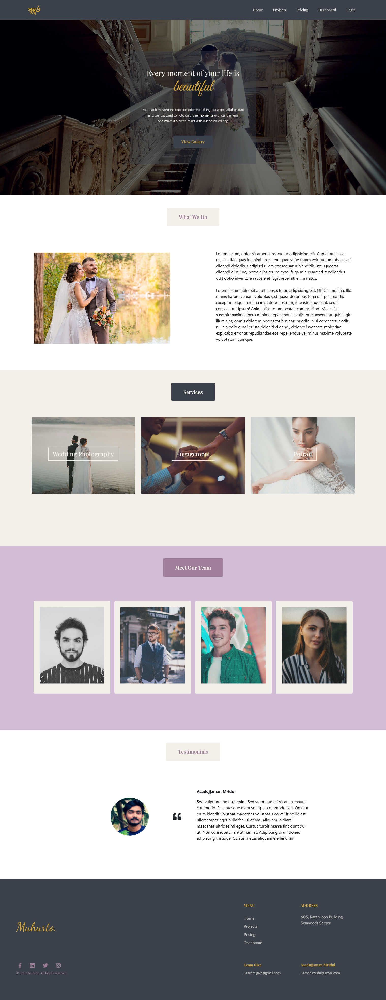
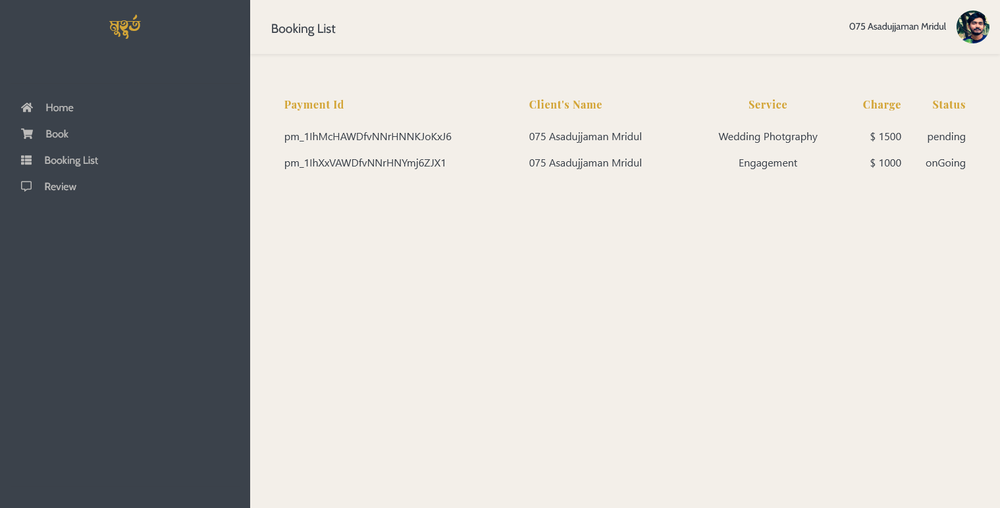
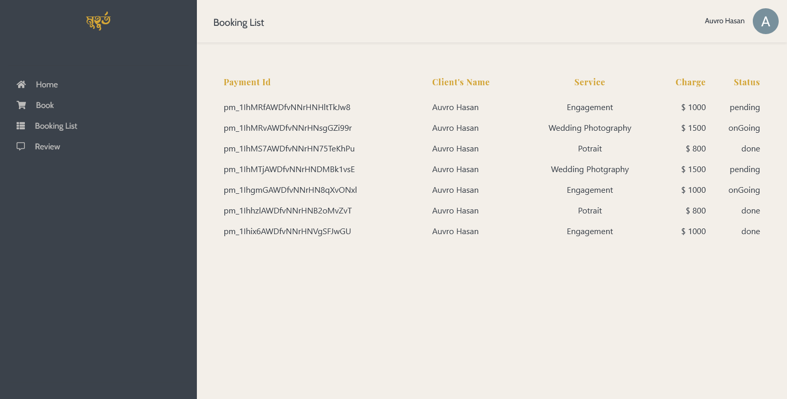
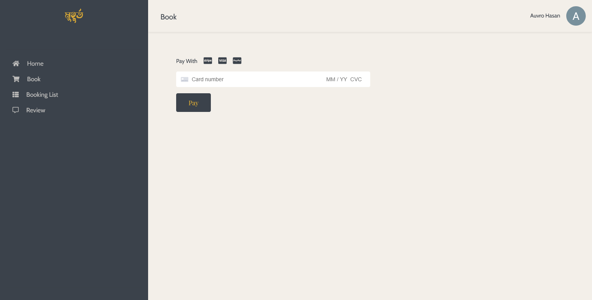
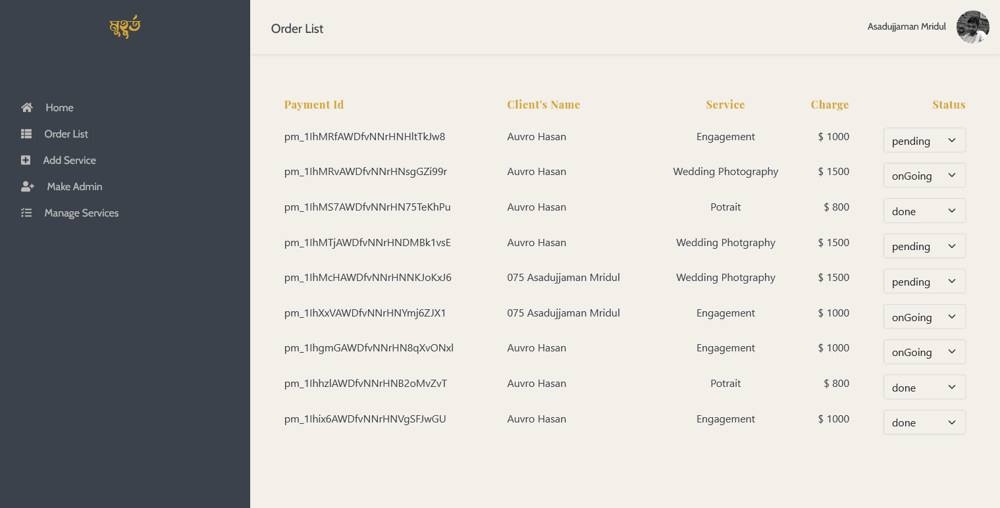
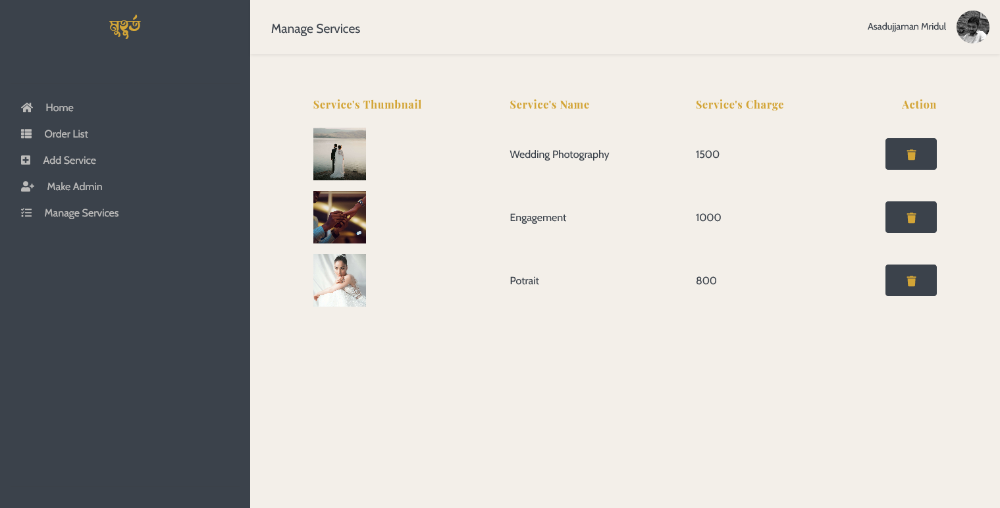

# Muhurto - Client

Capture your best moments with us!

## Overview
This is mainly a mockup website for a wedding photography team. We have used [Firebase Auth](https://firebase.google.com/docs/auth) for authenticate user and [MongoDB](https://www.mongodb.com/) for storing the database for this project.

User can select any services (i.e: wedding photography, potrait package, engagement package etc.) he/she likes. Then he/she will be redirected to **login page** (if not logged in). We have used firebase authentication system for this purpose. So, any user with a google account can sign-in or sign-up to this website. 
After successful login, user will be redirected to **dashboard**, where he/she can book their desired services. For payment, we have used [Stripe](https://stripe.com/) payment gateway. User can also chcek their booking lists, booking status, payment id from *Booking Lists* page. They can even post review regarding this website. Every review will be stored in database. When someone visit the website, he/she can see these reviews in the landing page.

There is also an **admin page** for managing bookings, services, admins etc. General user will not have access over this page, since we are filtering them with their email address. If any admin wants to add a new admin, he/she just have to go to *Add Admin* page, type the email address of the to-be admin and submit! As simple as that! An admin can change the status of any bookings, i.e: pending, onGoing, done, from *Order List* page. In addition, admin can also add new service and delete services through *Add Service* and *Manage Services* pages.

This website was only for development purpose. You can definitely check it out!

### Technology Used
• MERN Stack  
• Stripe Payment Gateway  
 
• Firebase Auth  
• Firebase Hosting  
 
• React Router  
• React Hook Form  
• Private Route  
• Bootstrap

## [Live Site](https://muhurto-photography.firebaseapp.com/)  
## [Server Side Repo](https://github.com/AsadujjamanMridul/muhurto-server/)

 
 

## Screenshots
#### Landing Page

 
#### User 1 Dashboard

 
#### User 2 Dashboard

 
#### Payment Gateway

 
#### Admin Dashboard

#### Manage Services

###### `Thank you`

